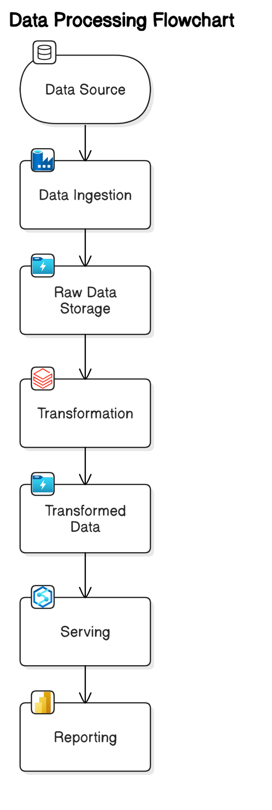

# Adventure-Works-Data-Engineering-Project

## Introduction 
The Adventure Works Data Project is a comprehensive data engineering initiative aimed at building a robust, scalable, and secure data ecosystem. The project leverages cutting-edge tools and technologies, including Python, SQL, Azure Data Factory, Azure Data Lake Gen 2, Azure Databricks, Azure Synapse Analytics, and Power BI.

##The primary goal of this project is to design and implement a multi-layered data lake architecture to support data ingestion, transformation, analysis, and visualization. The architecture consists of three key layers:

1. Raw Data Layer: This layer stores raw data as ingested from various sources, ensuring data integrity and providing a historical reference.
2. Processed Data Layer: This layer contains cleaned and transformed data, optimized for downstream processing and analysis.
3. Aggregated Data Layer: This layer is designed for high-performance querying and analytics, featuring pre-aggregated datasets tailored to business requirements.

##Key highlights of the project include:
1. Optimized Workflows: Developed efficient workflows using Azure Data Factory for data ingestion and transformation, ensuring minimal latency and high reliability.
2. Delta Tables: Integrated Delta Tables in Azure Databricks to enhance performance, enable real-time data updates, and simplify versioning.
3. Role-Based Access Control (RBAC): Implemented RBAC and Managed Identities to ensure secure and granular access to data resources.
4. Data Analytics and Visualization: Utilized Azure Synapse Analytics for data warehousing and Power BI for creating interactive dashboards and reports, enabling data-driven decision-making.

## About Dataset

The AdventureWorks databases are sample databases that were originally published by Microsoft to show how to design a SQL Server database using SQL Server 2008. AdventureWorks is the OLTP sample, and AdventureWorksDW is the data warehouse sample.

Dataset Link - https://www.kaggle.com/datasets/ukveteran/adventure-works

## Architecture

# Technology Used
1. HTTP Source (Git): To fetch data from the source repository.
2. Azure Data Factory (ADF): For seamless data transfer and orchestration.
3. Microsoft Azure: As the foundational cloud platform.
4. Databricks & PySpark: For data transformation and advanced processing.
5. Azure Datalake : To store raw and transformed data.
6. Azure Synapse Analytics: To build and manage a robust data warehouse.
7. Power BI: For creating interactive dashboards and visualisations.

